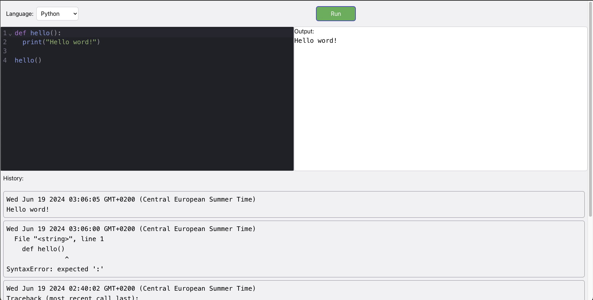

# Code Compiler Project

This project is a web-based code compiler that supports multiple programming languages. The frontend is built with React and Tailwind CSS, and the backend is powered by Python.

## Features

- Compile and run code in multiple programming languages: Java, JavaScript, Python, TypeScript
- Responsive UI built with React and Tailwind CSS
- Secure backend API built with Python 

## Installation

### Prerequisites

- Node.js (for frontend)
- [Back End API](https://github.com/smitkevadiya50/code-compiler-api)
- Python 3 (for backend)

## Screenshot

